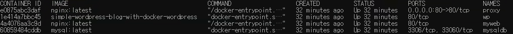

## 도커활용한 간단한 웰컴페이지와 블로그

## set-up

1.도커 컴포즈로 이미지 설치 및 컨테이너 올리기
- docker-compose up -d

2.현재 실행중인 도커 컨테이너 확인하기


- docker ps로 실행중인 도커 컨테이너를 확인할 수 있는데, 위와 같이 총 4가지(proxy, wp, myweb, mysql) 컨테이너가 실행중이다.
- proxy
    - proxy는 nginx reverse proxy이며, 클라이언트로 부터 온 요청에 따라 내부 서버에 접속하여 적절한 결과를 클라이언트에게 전달한다.(리버스 프록시를 사용함으로써 내부 직접접근을 막아 보안에 유리하고, 로드 밸런싱이 가능하기 때문에 트래픽 관리에도 좋다)

- wp
    - wp는 워드프레스 서버이며, html폴더로 볼륨설정되어있다.

- myweb
    - myweb은 nginx 서버이며, myweb폴더로 볼륨설정되어있다.

- db
    - 이 프로젝트에서는 간단한 도커활용을 목표로 하였기 때문에 Mysql DB의 실질적인 사용은 없고, 컨테이너에만 추가하였다.(이후 컨테이너간의 통신을 할 때 적절히 활용해볼예정이다)

- 위 컨테이너에 대한 정보는 **docker-compose.yml** 에서 확인 가능하다.

3.워드프레스가 파일 시스템에 접근할 수 있도록 파일 수정하기
- 먼저 워드프레스 컨테이너 내부로 접속하기
    - docker exec -it wp /bin/bash
- html/wp-config.php 파일을 찾아 수정하기
    - vi wp-config.php로 들어가서
    - @package WordPress 아래쪽에 아래 코드를 추가
```php
define('FS_METHOD','direct');
```
해당 코드는 워드프레스가 파일 시스템에 직접 접근하여 파일을 수정할 수 있도록 권한을 주기 위함이다.

4.수정된 wp-config.php 파일을 blog폴더 하위로 복사
- cp wp-config.php blog/

## 사이트 접속하기
### http://<본인의 IP>

위 주소로 접속하면 아래와 같이 네임카드를 볼 수 있다.(nginx 서버에서 제공)


### http://<본인의 IP>/blog

위 주소로 접속하면 아래와 같이 워드프레스 블로그를 확인할 수 있다.(wordpress 서버에서 제공)
